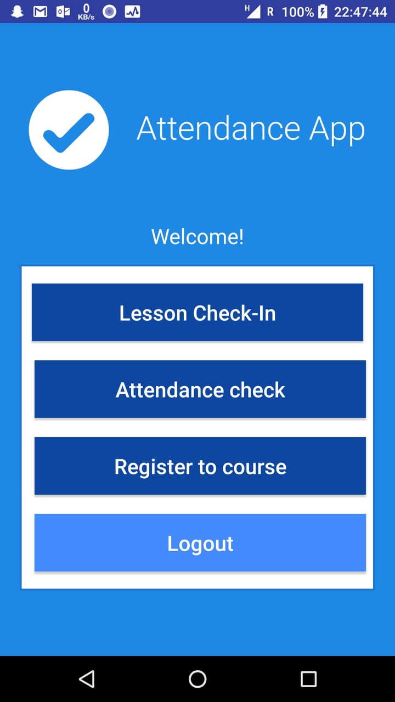
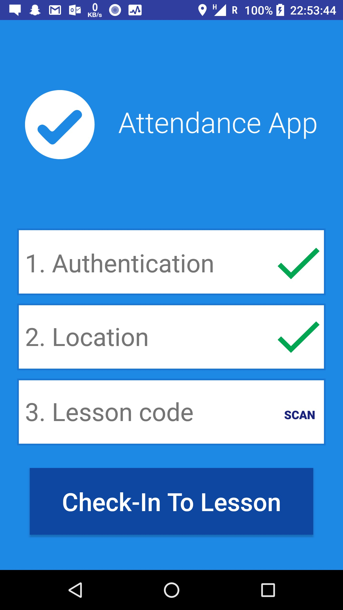
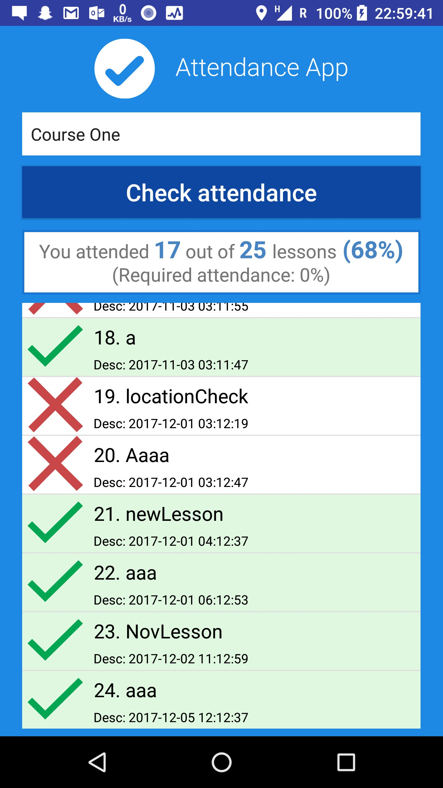
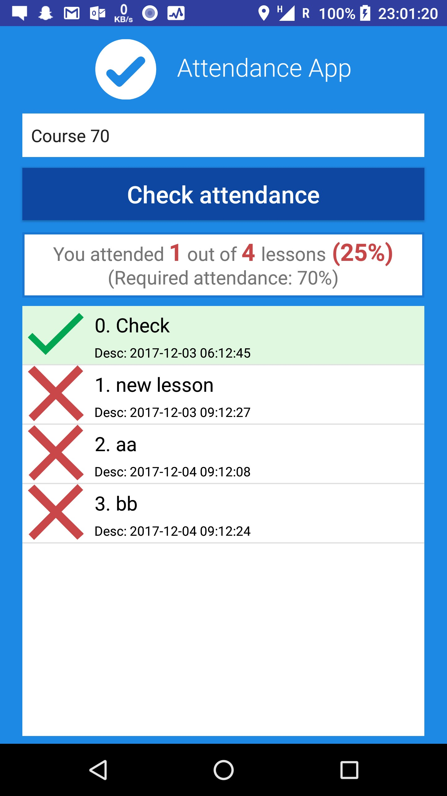
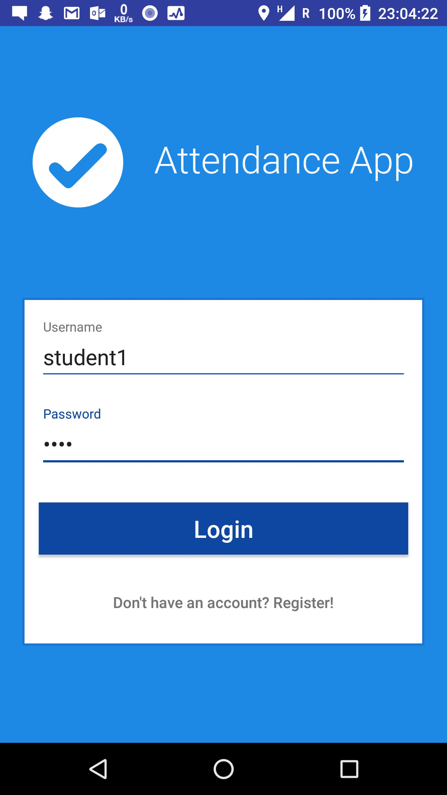
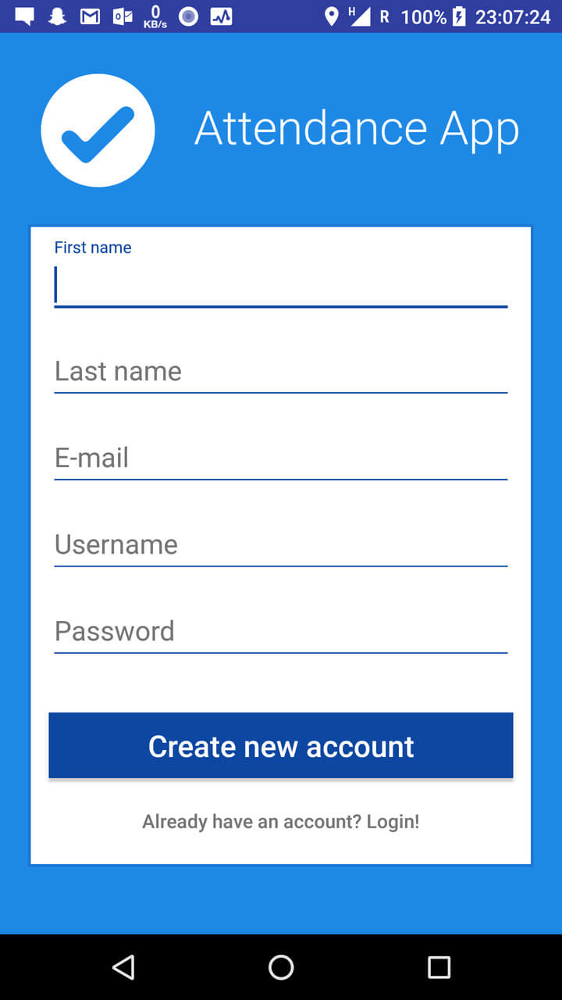

Attendance App 
==============
Attendance App is an Android app, combined with a simple server application in PHP and mySQL database to check student attendance at lectures.  
For the php server, check the **INSERT LINK** repository.

Problem
-------------
The app solves a problem of checking attendance of the people at some event – 
at lectures at the university, lab practices, conferences...
Its use could be extended to all scenarios, where checking attendance is needed.

In most cases, especially at university lectures, very outdated systems to 
check the attendance are being used. Usually a slate of paper is as high-tech as it gets...

Solution
------------
**AttendanceApp** is an Android app, used for scanning QR code at the lecture and thus confirming student's attendance at the lecture.  

It also has a few safety switches built-in in order to prevent "fake" attendances - QR code needs to be scanned near to location
that lecturer entered as a location of the lecture. The location is checked by the cellular network (since GPS signal is usually weak
inside a lecture hall).

Architecture
------------
* Android app for students
* Web application (PHP) to access/edit data for administrators - teachers
* mySQL database

Application overview
=====================
Screenshots of the basic functionalities of the app.

Home Page
---------

Lesson Check-In
---------------

Attendance Check
----------------

  

Register To Course
------------------

Login
-----

Registration
------------

