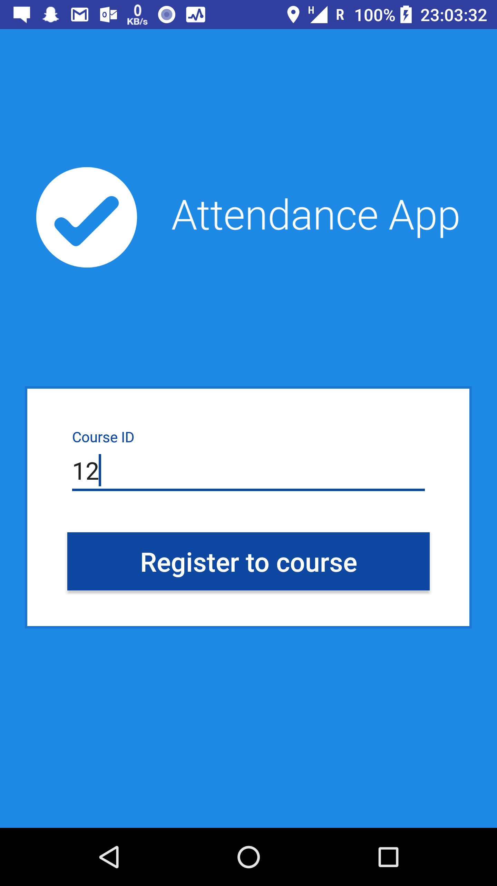

Attendance App 
==============
Attendance App is an Android app, combined with a simple server application in PHP and mySQL database to check student attendance at lectures.  
For the php server, see <a href="https://github.com/janstarc/Attendance">this</a> repository.

Problem
-------------
The app solves a problem of checking attendance of the people at some event – 
at lectures at the university, lab practices, conferences, etc.
Its use could be extended to all scenarios, where checking attendance is needed.

In most cases, especially at university lectures, very outdated systems to 
check the attendance are being used. Usually a slate of paper is as high-tech as it gets...

Solution
------------
**AttendanceApp** is an Android app, used for scanning QR code at the lecture and thus confirming student's attendance at the lecture.  

It also has a few safety switches built-in in order to prevent "fake" attendances - QR code needs to be scanned near to location
that lecturer entered as a location of the lecture. The location is checked by the cellular network (since GPS signal is usually weak
inside the lecture hall).

Architecture
------------
* Android app for students
* Web application (PHP) to access/edit data for administrators - teachers
* mySQL database

Application overview
=====================
Screenshots of the basic functionalities of the app.

Home Page
---------
Main menu of the app - users can check in to lesson, check presence at previous lessons and register to a new course.

Lesson Check-In
---------------
Main feature of the app. Students can confirm their attendance at lessons by scanning the QR code, that is unique for every lesson.
The app confirms login, gets GPS coordinates of the phone location and then asks user to scan the QR code.

When QR code is scanned, the app checks if user's GPS coordinates match with the coordinates of the lesson and if
the student is attending the course. If all the data fits, then the attendance is confirmed.
 

Attendance Check
----------------
Here users can choose a course from a dropdown menu and check attendance at previous lectures of the course. They can also check required (obligatory) attendance at lectures of the course.

  

Register To Course
------------------
Lessons a student is attending can be added here by simply typing the Course ID.

Login
------------------
Login for registered users.

Registration
------------
Registration for new users.

